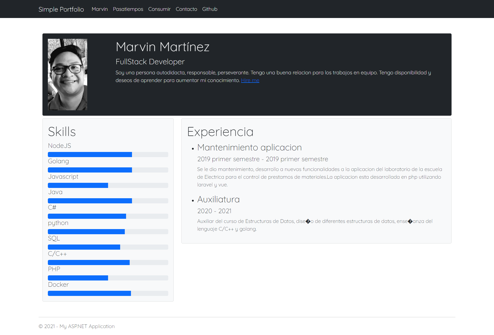

para crear una aplicacion por consola se utiliza el siguiente comando, utilizando el sdk
```bash
dotnet new console -o NAME_FOLDER
```

Para instalar las dependencias y preparar el proyecto es con dotnet restore.
```bash
dotnet restore
```

Para correr un proyecto es con dotnet run
```bash
dotnet run
```

Para crear una aplicacion web se utiliza el siguiente comando.
```bash
dotnet new mvc -o NAME_FOLDER
```

Para crearla sin autentificacion se utiliza el parametro -au
```bash
dotnet new mvc -au None -o NAME_FOLDER
```


